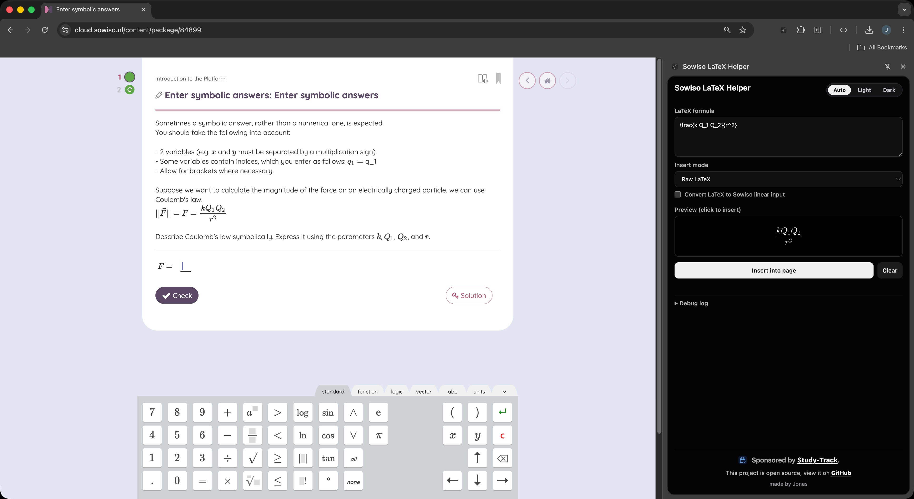

  
  <h1>Sowiso LaTeX Helper</h1>
  

    Tiny Chrome extension made to speed up writing math in Sowiso. 
    
  

  

    Language:
    <a href="README.md">English</a> –
    <a href="README.nl.md">Nederlands</a>
  

---

	

---

## What It Does

- Opens as a side panel in Chrome.
- Lets you paste or type LaTeX.
- Shows a live preview.
- Inserts the formula into the currently active Sowiso input.
- Supports 3 insert modes:
  - `Raw LaTeX`
  - `Inline ($...$)`
  - `Block ($$...$$)`
- Optional conversion to Sowiso linear input.
- Theme switcher: `Auto`, `Light`, `Dark`.
- Includes a debug log (with copy/clear buttons) for quick troubleshooting.

---

## Supported Pages

- `https://cloud.sowiso.nl/*`
- `https://*.sowiso.nl/*`

---

## Install (Unpacked)

1. Open Chrome and go to `chrome://extensions`.
2. Enable `Developer mode` (top right).
3. Click `Load unpacked`.
4. Select: `chrome-extension`
5. (Optional) pin the extension in your toolbar.

---

## How To Use

1. Open a Sowiso exercise page.
2. Click once in the answer field you want to fill.
3. Open the extension side panel.
4. Enter your LaTeX.
5. Pick insert mode.
6. (Optional) enable `Convert LaTeX to Sowiso linear input`.
7. Click `Insert into page` or click the preview block.

---

## Notes

- Preview rendering uses CodeCogs (`https://latex.codecogs.com`) and needs internet access.
- If insertion fails, click the answer field again and retry.
- The extension tries multiple insertion strategies and frame contexts.

---

## Privacy

- No backend server for this extension.
- Settings are stored locally via `chrome.storage.local` (theme mode, etc.).
- Your formula is used locally for insertion and sent to CodeCogs only for preview image rendering.

See more: [Privacy Policy](public/privacy-policy.md)

---

## Development

Project structure:
- `chrome-extension/` - extension source (manifest, popup, background, content script)
- `public/` - logos and design assets

Run locally:
1. Load `chrome-extension` as unpacked extension.
2. Make code changes.
3. Reload extension in `chrome://extensions`.

---

## Links

- Sponsor: [Study-Track](https://study-track.app/?ref=sowiso-latex-helper)
- GitHub: [flodlol/Sowiso-LaTeX-Helper](https://github.com/flodlol/Sowiso-LaTeX-Helper)

---

## License

MIT — do whatever you want with it.

---

  If you find this useful, a star on GitHub would be nice. ⭐  
  Thanks for checking it out! ❤️
   
  <a href="https://github.com/sponsors/flodlol">Sponsor this project</a>

